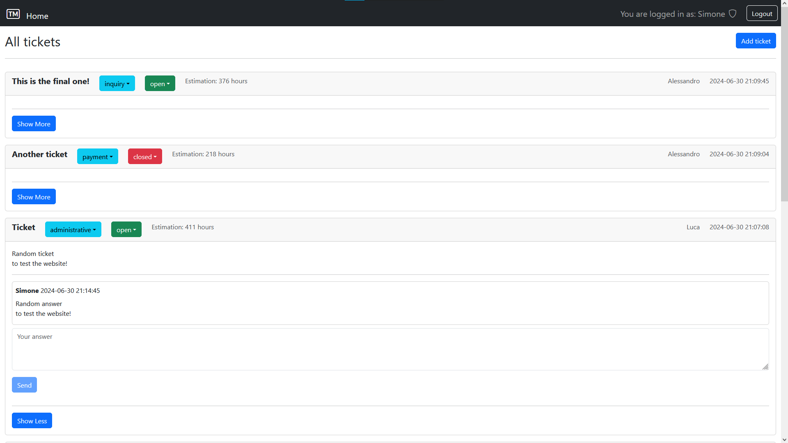
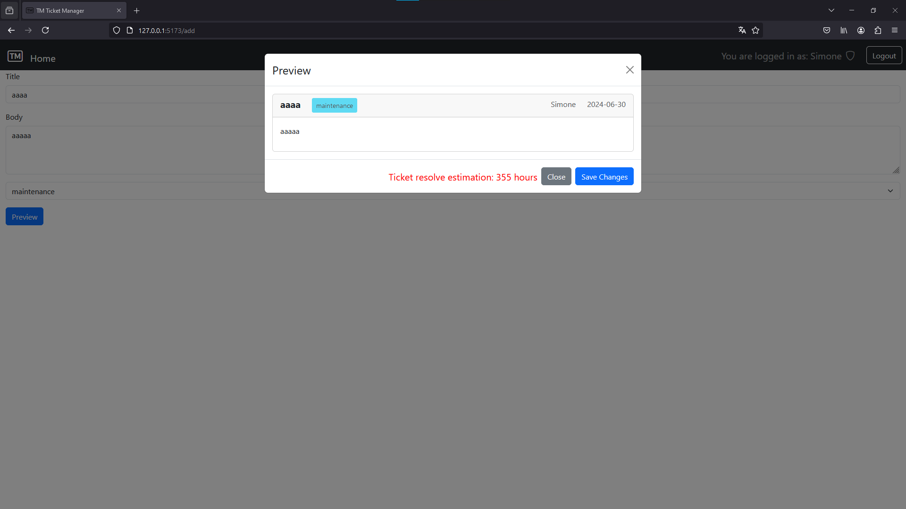

Simple online Single Page Application developed for the Web Application course, MSc in Cybersecurity at Politecnico di Torino.

# Exam #1: "Ticketing System"
## Student: s329226 Firrera Manuel 

## React Client Application Routes

- Route `/`: main page showing the tickets, their state and where they can eventually be expanded.
- Route `/login`: login page containing the login form.
- Route `/add`: ticket submission page, the page contains the form and also shows the preview of the ticket in a modal.
- Route `*`: default route used to notify the inexistence of the inserted route.

## API Server

- GET `/api/tickets`
  - Description: returns a list of tickets depending on the authentication state, unauthenticated users will receive a ticket with empty body.
  - Response body: JSON object with the list of the tickets or description of errors.
  ```json
  [
    {
        "id": 1,
        "status": "open",
        "category": "category",
        "body": "something\nsomething",
        "title": "title",
        "timestamp": "YYYY-MM-DD HH:MM:SS",
        "userId": 1,
    },
    {},{}
  ]
  ```
  - Codes: `200 OK`, `500 Internal Server Error`.

- GET `/api/categories`
  - Description: returns the categories accepted by the server.
  - Response body: JSON object with the list of categories or description of errors.
  ```json
  [
    {
        "id": 1,
        "name": "category",
    },
    {},{}
  ]
  ```
  - Codes: `200 OK`, `500 Internal Server Error`, `401 Not authorized`.

- GET `/api/blocks/:id`
  - Description: returns the blocks for a selected ticket by the id parameter.
  - Parameters: id of the ticket.
  - Response body: JSON object with the list of blocks or description of errors.
  ```json
  [
    {
        "id": 1,
        "ticketid": 1,
        "userid": 1,
        "body": "smth\nsmth",
        "timestamp": "YYYY-MM-DD HH:MM:SS",
    }, {}, {}
  ]
  ```
  - Codes: `200 OK`, `500 Internal Server Error`, `401 Not authorized`.

- POST `/api/tickets`
  - Description: used to push a new ticket into the database.
  - Request body: JSON object with the fields of the ticket.
  ```json
    {
        "category": "category",
        "body": "something\nsomething",
        "title": "title",
    },
  ```
  - Response body: JSON object with the complete ticket object or description of errors.
  ```json
    {
        "id": 1,
        "status": "open",
        "category": "category",
        "body": "something\nsomething",
        "title": "title",
        "timestamp": "YYYY-MM-DD HH:MM:SS",
        "userId": 1,
    },
  ```
  - Codes: `200 OK`, `500 Internal Server Error`, `401 Not authorized`, `422 Unprocessable entity`.

  - POST `/api/blocks`
    - Description: used to push a new response(block) to a specified ticket.
    - Request body: JSON object with data to add the block.
    ```json
    {
        "ticketid": 1,
        "body": "something\nsomething",
    },
  ```
    - Response body: JSON object with the newly created block or description of errors.
    ```json
    {
        "id": 1,
        "ticketid": 1,
        "userid": 1,
        "body": "smth\nsmth",
        "timestamp": "YYYY-MM-DD HH:MM:SS",
    },
  ```
    - Codes: `200 OK`, `500 Internal Server Error`, `401 Not authorized`, `422 Unprocessable entity`.

  -PUT `/api/tickets/:id/status`
    - Description: modify the status of the ticket selected by id parameter.
    - Request body: JSON object with the new status.
    ```json
    {
        "status": "closed",
    },
  ```
    - Response body: JSON object with the updated ticket or description of errors.
    ```json
  [
    {
        "id": 1,
        "status": "open",
        "category": "category",
        "body": "something\nsomething",
        "title": "title",
        "timestamp": "YYYY-MM-DD HH:MM:SS",
        "userId": 1,
    },
  ]
  ```
  - Codes: `200 OK`, `500 Internal Server Error`, `401 Not authorized`, `422 Unprocessable entity`.

- PUT `/api/tickets/:id/status`
    - Description: modify the status of the ticket selected by id parameter.
    - Request body: JSON object with the new category
    ```json
    {
        "category": "category",
    },
  ```
    - Response body: JSON object with the updated ticket or description of errors.
    ```json
    {
        "id": 1,
        "status": "open",
        "category": "category",
        "body": "something\nsomething",
        "title": "title",
        "timestamp": "YYYY-MM-DD HH:MM:SS",
        "userId": 1,
    },
  ```
  - Codes: `200 OK`, `500 Internal Server Error`, `401 Not authorized`, `422 Unprocessable entity`.

### Authentication APIs

- POST `/api/sessions`
  - Description: authenticate and login the user.
  - Request body: JSON object containing username and password.
    ```json
    {
        "username": "username",
        "password": "password",
    },
  ```
    - Response body: JSON object containing user data or description of  errors.
    ```json
    {
        "id": 1,
        "username": "username",
        "admin": 1,
    },
  ```
  - Codes: `200 OK`, `401 Not authorized`.

- GET `/api/session/current`
  - Description: Get the informations of the current user.
  - Response body: JSON object containing user data or description of  errors.
  ```json
  {
    "id": 1,
    "username": "username",
    "admin": 1,
  }
  ```
  - Codes: `200 OK`.

- DELETE `/api/sessions`
  - Description: Log out of the system.
  - Codes: `200 OK`

### Token APIs

- GET `/api/auth-token`
  - Description: Get the jwt token for the current user
  - Token payload: JSON object with embedded token.
  ```json
  { "role": "admin", "userId": 1 }
  ```
  - Codes: `200 OK`, `401 Not authorized`.

  
## API Server2

- POST `/api/estimate`
  - Description: Get the estimation of the closing time if a valid token is provided.
  - Request body: JSON object with the data for the estimation.
  ```json
  {
      "title": "Ticket 1",
      "category": "inquiry"
  }
  ```
  - Response body: JSON object containing the estimation or description of errors.
  ```json
  {
      "estimation": 400,
  }
  ```
  - Codes: `200 OK`, `401 Not authorized`, `500 Internal Server Error`,`422 Unprocessable entity`.

## Database Tables
- Table `USERS`  - contains id, username, salt, hash, admin(0/1)
- Table `TICKETS` - contains id, status(open, closed), category(inquiry, maintenance, new feature, administrative, payment), owner id, title, created timestamp, body (the description of the ticket)
- Table `BLOCKS` - contains id, userid, ticketid, body, timestamp
- Table `CATEGORIES` - constains id and name of the categories.


## Main React Components

- `GenericLayout` (in `Layout.jsx`): Base application component, it manages the layout of all the pages and error display functionality.
- `Navigation` (in `Navigation.jsx`): Displays the nawbar wi the login button or the username of the logged in user.
- `NotFounLayout` (in `Navigation.jsx`): Displays the default route output and redirects to home.
- `LoginForm` (in `Auth.jsx`): Displays the login form and handles the submission of user credentials.
- `TicketForm` (in `TicketEdit.jsx`): Displays the ticket submission form and manages data input from user. It uses FormFields and PreviewModal components.
- `PreviewModal` (in `PreviewModal.jsx`): Displays the preview Modal in the submission page. The modal contains a prewiew of the ticket as it will appear in the main page. It also displays the estimated closing time.
- `Ticket` (in `TicketCard.jsx`): Ticket card render component, it is composed by an header and a body which will display the data of the ticket and provide the functionalities to the users.
It uses TicketHeader and TicketBody components.
- `TicketHeader` (in `TicketHeader.jsx`): Renders the header of the tickets which contains buttons to close it, change the category if an admin is logged in, display title, author and getting the estimate of the closing time. 
- `TicketBody` (in `TicketBody.jsx`): Provides the collapsing feature of the tickats. It calls BlockList and BlockForm.
- `BlockList` (in `BlockList.jsx`): Renders all the blocks associated to the ticket.
- `BlockForm` (in `BlockForm.jsx`): Handles the text submission form for the ticket.

## Screenshot


main page.

ticket submission page with modal.

## Users Credentials

- USERNAME, PASSWORD, ISADMIN
- Manuel, admin, YES
- Simone, pwd, YES
- Alessandro, dwp, NO
- Luca, pecora, NO
- Davide, password, NO

